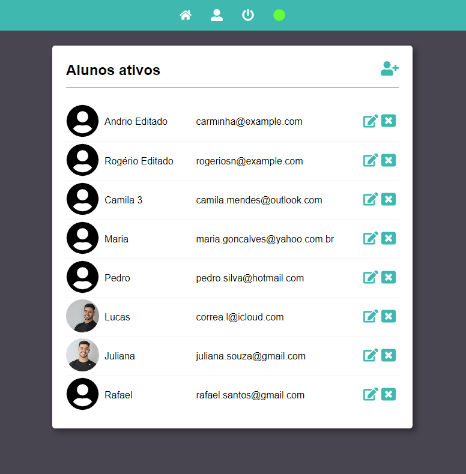
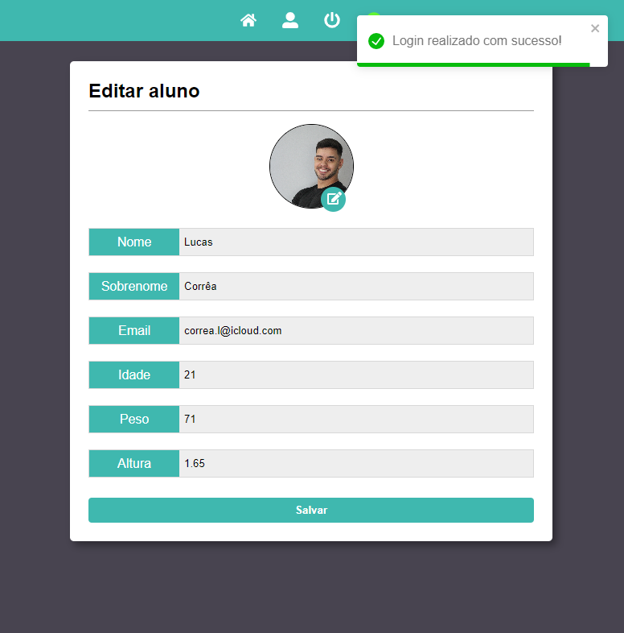
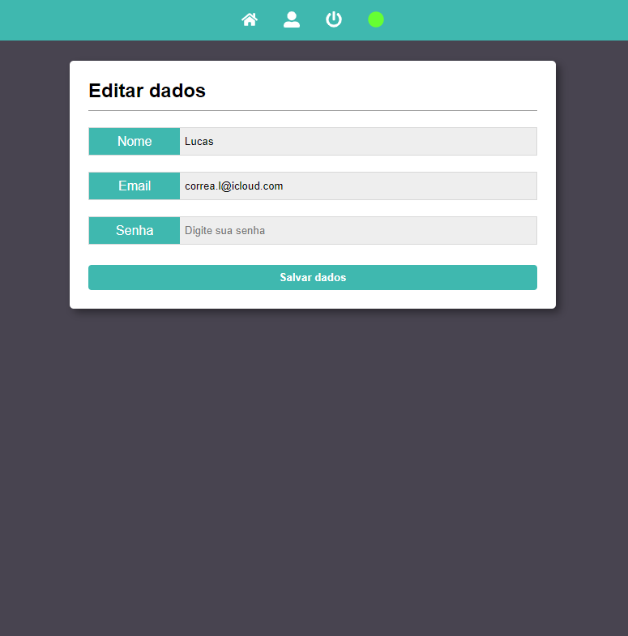
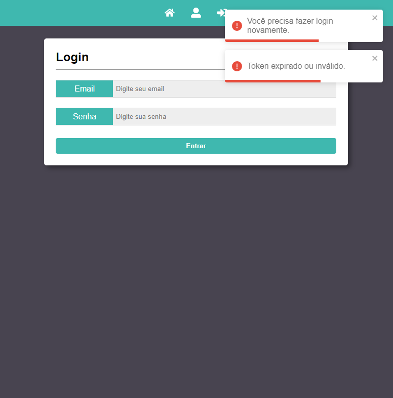

# SchoolAPP

# ☕ Descrição do Projeto

Projeto em React que fiz para consumir a API de um curso de APIRest, o projeto consta com várias libs, como Redux, Router Dom V6, Axios, entre outros...

## 🤝 Autor

Me chamo Lucas Corrêa, tenho 22 anos, e moro no Rio Grande do Sul.

<table>
  <tr>
    <td align="center">
      <a href="https://www.linkedin.com/in/correalucas0105/">
         
        
            <b>Lucas Corrêa</b>
        
      </a>
    </td>
</table>

OBRIGADO!
